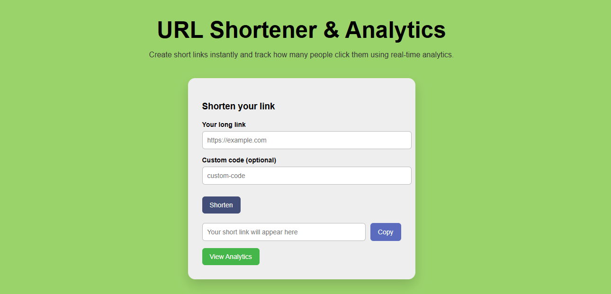
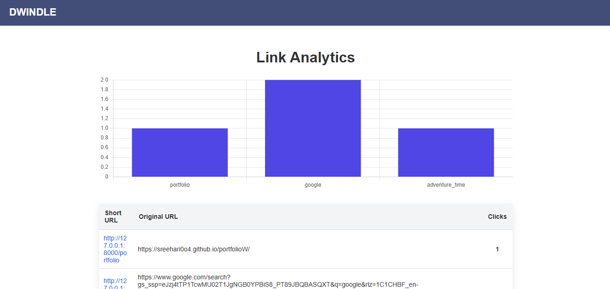

# Dwindle – URL Shortener & Analytics

A full-stack **URL shortening service with real-time analytics**, built using **FastAPI, PostgreSQL, Redis, and Docker**.

Dwindle allows users to create short links, track how many people click them, and view analytics through a simple dashboard.

---

# Features

## URL Shortening
Generate short links for long URLs.

Example:

```text
https://example.com/some/very/long/url
↓
http://localhost:8000/abc123
```

## Custom Short Codes
Create your own readable links.

```text
/github
/docs
/project
```

## Link Expiration
Links can optionally expire after a specified time.

## Click Analytics
Track how many times each shortened link is used.

## Analytics Dashboard
View analytics through an interactive dashboard with charts.

## Redis Caching
Redirect performance is improved using Redis caching.

## PostgreSQL Database
Persistent storage for links and analytics.

## Docker Deployment
Run the entire stack using Docker containers.

---

# Architecture

```text
Browser
↓
FastAPI API
↓
Redis Cache
↓
PostgreSQL Database
```

Redis caches frequently accessed short links to reduce database load.

---

# Tech Stack

### Backend
FastAPI  
SQLAlchemy ORM  
Alembic (database migrations)

### Database
PostgreSQL

### Caching
Redis

### Frontend
HTML  
JavaScript  
Chart.js

### Infrastructure
Docker  
Docker Compose

---

# Project Structure

```text
url-shortener/
│
├── app/
│   ├── main.py
│   ├── models.py
│   ├── database.py
│   ├── cache.py
│   ├── schemas.py
│
├── frontend/
│   ├── index.html
│   ├── analytics.html
│
├── alembic/
│   ├── versions/
│   ├── env.py
│
├── Dockerfile
├── docker-compose.yml
├── requirements.txt
├── alembic.ini
├── README.md
└── .gitignore
```

---

# Setup and Installation

You can run the project **either locally or using Docker**.

---

# Option 1 – Run Using Docker (Recommended)

This starts:

- FastAPI
- PostgreSQL
- Redis

### 1. Install Docker

Install Docker from: https://www.docker.com/

### 2. Clone the Repository

```bash
git clone https://github.com/Sreehari0o4/Dwindle-URL_Shortener.git
cd Dwindle-URL_Shortener
```

### 3. Start Containers

```bash
docker compose up --build
```

### 4. Open the Application

- Dashboard: http://localhost:8000/dashboard  
- Analytics: http://localhost:8000/analytics-page  
- API docs (Swagger UI): http://localhost:8000/docs

---

# Option 2 – Run Locally (Development)

### 1. Create Virtual Environment

```bash
python -m venv venv
```

Activate it:

**Windows**

```bash
venv\Scripts\activate
```

**macOS / Linux**

```bash
source venv/bin/activate
```

### 2. Install Dependencies

```bash
pip install -r requirements.txt
```

### 3. Run the Server

```bash
uvicorn app.main:app --reload
```

### 4. Open the Dashboard

Dashboard: http://127.0.0.1:8000/dashboard

---

# Database Migrations

Alembic is used for managing database schema changes.

Create a migration:

```bash
alembic revision --autogenerate -m "migration message"
```

Apply migrations:

```bash
alembic upgrade head
```

---

# API Endpoints

## Create Short URL

```http
POST /shorten
```

Example request body:

```json
{
	"url": "https://example.com",
	"custom_code": "optional"
}
```

---

## Redirect Short URL

```http
GET /{short_code}
```

---

## List All URLs

```http
GET /urls
```

---

## Get Analytics

```http
GET /analytics/{short_code}
```

---

# Screenshots

## Dashboard



## Analytics



---

# Future Improvements

Possible improvements:

- Click history over time
- Top-performing links
- Country-based analytics
- User authentication
- Browser extension
- Public API access

---

# Author

**Sreehari S Kumar**  
BTech IT – CUSAT  

Interested in backend engineering, DevOps, and system design.

---

